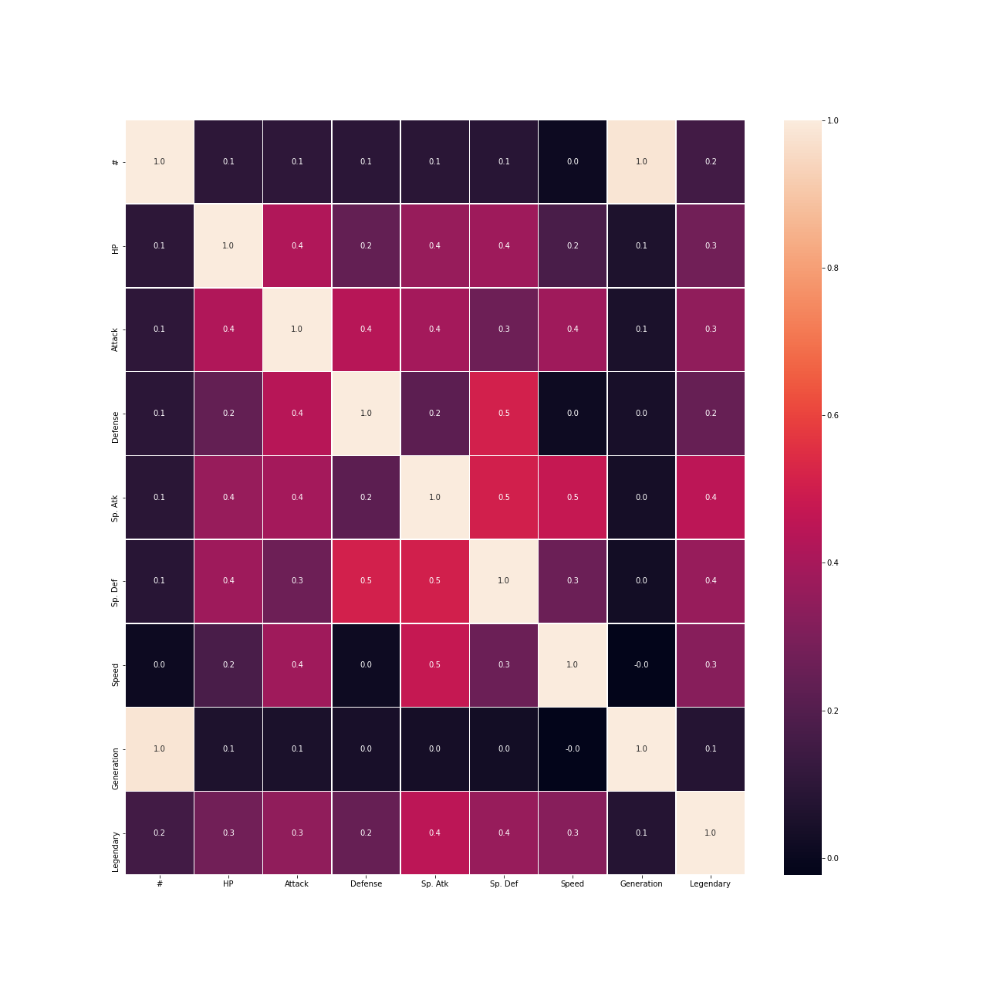
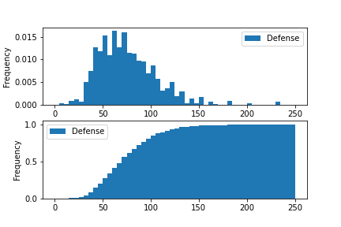
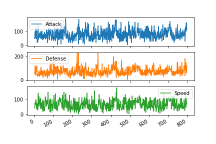
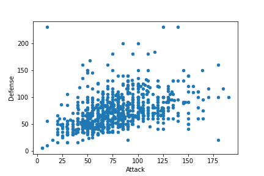

# DATA SCIENCE MACHINE LEARNING DOCUMENTS

#### Project Includes:

- Base structure (directories) for machine learning and data science projects.
- Data science cheat sheet has been added in CODE/data_science_cheatsheet.py
- Covered information:
-  Basics of python, Pandas, Numpy knowledge.
-  Calculate metrics about your data.
-  Perform basic queries and aggregations on dataframes.
-  Discover and handle incorrect data, inconsistencies, and missing values.
-  Visualize your data with plots.

Hope this helps you in your next machine learning exploration.

resource:
https://realpython.com/pandas-python-explore-dataset/
https://www.kaggle.com/kanncaa1/data-sciencetutorial-for-beginners

Database: https://www.kaggle.com/terminus7/pokemon-challenge

